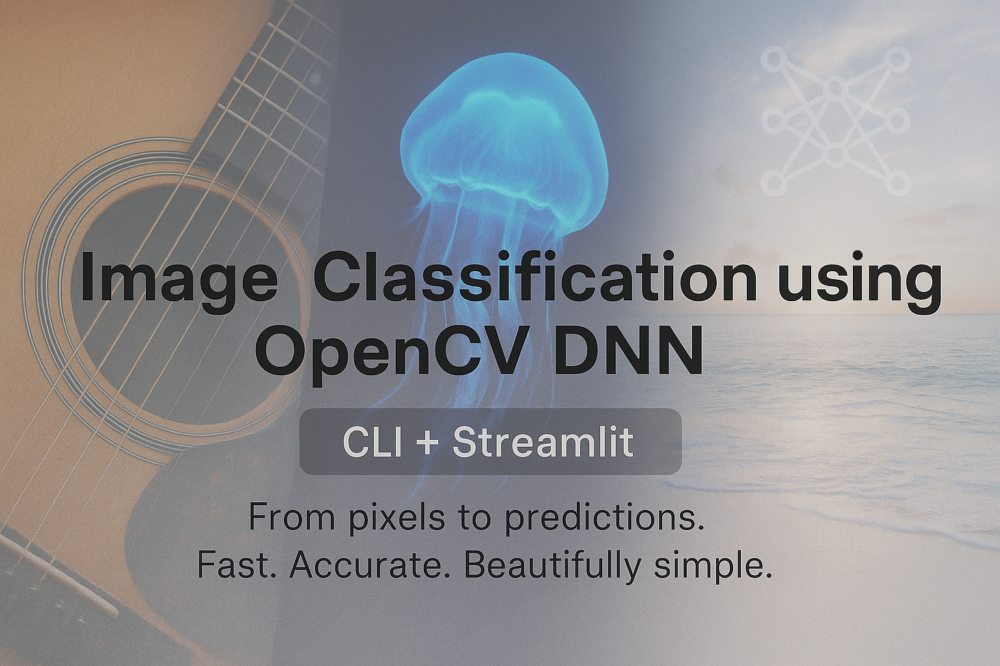
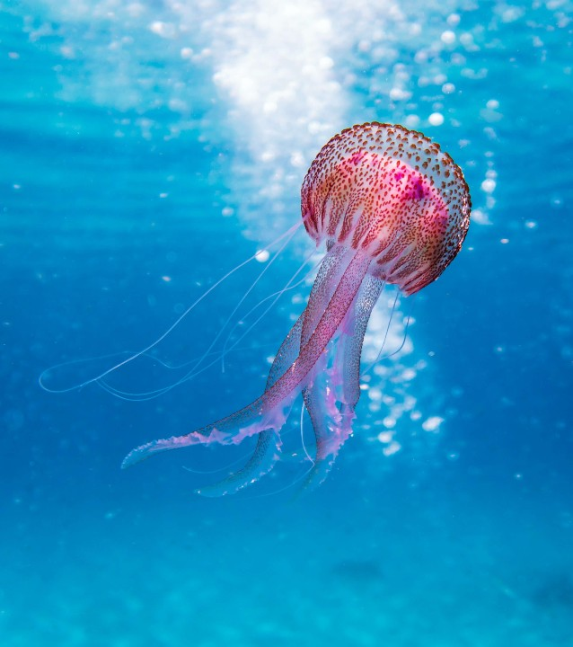
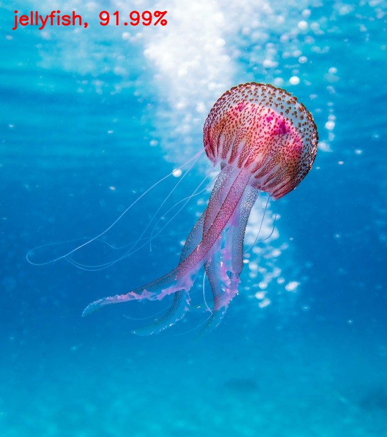

# 🔍 OpenCV DNN Image Classifier



[](https://www.python.org/)
[](https://opencv.org/)
[](https://streamlit.io/)
[](LICENSE)
[](https://github.com/HeleenaRobert)

A dual-interface image classification app using OpenCV's Deep Neural Network (DNN) module.  
It supports both a **Command-Line Interface (CLI)** for local batch processing and a **Streamlit Web App** for real-time classification using drag & drop or image URLs.

---

## 🚀 Key Features

- 📦 Pretrained **DenseNet-121** (Caffe) model
- 🧠 Classifies images using **ImageNet** classes
- 🖼️ Works with local `.jpg/.png` images or live uploads
- 🌐 Web UI with **Streamlit**
- 💾 Labeled outputs saved locally
- 🔧 Easy to switch models or labels

---

## 📁 Folder Structure

```bash
opencv-dnn-image-classifier/
├── app.py                        # Streamlit web app
├── run_local.py                 # CLI script for batch classification
│ 
├── models/                      # Contains model files (.caffemodel, .prototxt)
│   ├── DenseNet_121.prototxt
│   └── DenseNet_121.caffemodel
│ 
├── utils/
│   └── classifier.py            # Shared model loader and classify() function
│ 
├── input/                       # Input images for CLI mode
│   ├── image1.jpg
│   ├── image2.jpg
│   └── image3.jpg
│ 
├── output/                      # Labeled image results
│   ├── labeled_image1.jpg
│   ├── labeled_image2.jpg
│   └── labeled_image3.jpg
│ 
├── classification_classes_ILSVRC2012.txt
├── requirements.txt
├── .gitignore
├── README.md
├── LICENSE
└── banner.png
```

---

## ⚙️ Installation

```bash
git clone https://github.com/HeleenaRobert/opencv-dnn-image-classifier.git
cd opencv-dnn-image-classifier

# Install dependencies
pip install -r requirements.txt
```

---

## 📥 Model Files

This project requires the **DenseNet-121** model files (`.caffemodel` and `.prototxt`) which are not included in the repository due to size.  
See [model_download_instructions.md](models/model_download_instructions.md) for details on how to download and set them up.

---

## 🧠 Model Info

This project uses [DenseNet-121](https://github.com/shicai/DenseNet-Caffe) pretrained on ImageNet (1,000 classes).

- Framework: **Caffe**
- Input size: **224x224**
- Class labels: `classification_classes_ILSVRC2012.txt`

---

## 🖥️ Run the CLI App

Put your `.jpg` or `.png` images in the `input/` folder and run:

```bash
python run_local.py
```

Labeled images will be saved to `output/`.

---

## 🌐 Run the Web App (Streamlit)

```bash
streamlit run app.py
```

Then open [http://localhost:8501](http://localhost:8501) in your browser.

---

## 🔍 CLI Sample Input/Output

 

---

## 📝 License

[MIT License](LICENSE)
© Heleena Robert  
Feel free to fork, use, and contribute ❤️

---

## 👤 Author

Developed by [Heleena Robert](https://github.com/HeleenaRobert)

---

## ✨ Acknowledgments

- [OpenCV DNN Docs](https://docs.opencv.org/master/d6/d0f/group__dnn.html)
- [ImageNet Labels](https://www.image-net.org/)
- [Streamlit](https://streamlit.io/)
